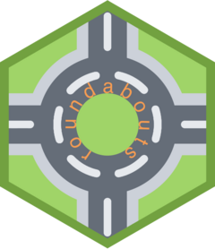
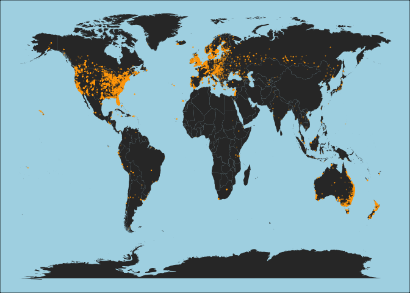

<!-- README.md is generated from README.Rmd. Please edit that file -->

# roundabouts 

<!-- badges: start -->
<!-- badges: end -->

The goal of roundabouts is to provide a R friendly way to access the
roundabouts data from <https://roundabouts.kittelson.com/>.

## Installation

You can install the development version of roundabouts like so:

``` r
pak::pak("emilhvitfeldt/roundabouts")
```

## Example

The `roundabouts` data set:

``` r
library(roundabouts)
dplyr::glimpse(roundabouts)
#> Rows: 27,887
#> Columns: 13
#> $ name                  <chr> "Arapahoe Ave. / 4th St.", "Arapahoe Ave. / 5th …
#> $ address               <chr> "Boulder, Boulder Co., CO (United States)", "Bou…
#> $ coordinates           <chr> "-105.2916,40.01294", "-105.28919999999999,40.01…
#> $ type                  <chr> "Traffic Calming Circle", "Traffic Calming Circl…
#> $ status                <chr> "Existing", "Existing", "Existing", "Existing", …
#> $ year_completed        <chr> "0", "0", "0", "0", "0", "0", "0", "0", "1997", …
#> $ approaches            <chr> "3", "3", "4", "4", "0", "0", "0", "0", "4", "0"…
#> $ driveways             <chr> "0", "0", "0", "0", "0", "0", "0", "0", "0", "0"…
#> $ lane_type             <chr> "Single-Lane", "Single-Lane", "Single-Lane", "Si…
#> $ functional_class      <chr> "Other (At-Grade)", "Other (At-Grade)", "Other (…
#> $ control_type          <chr> "One-Way/Two-Way Stop", "One-Way/Two-Way Stop", …
#> $ other_control_type    <chr> "None", "None", "Unknown", "Unknown", "Unknown",…
#> $ previous_control_type <chr> "Unknown", "Unknown", "Unknown", "Unknown", "Unk…
```

We can visualize the locations of the collected roundabouts

``` r
library(tidyverse)

world_map <- map_data("world")

roundabouts_loc <- roundabouts |>
  separate(coordinates, c("lon", "lat"), sep = ",", convert = TRUE)

distinct(world_map, region) %>% 
  ggplot(aes(map_id = region)) +
  geom_map(map = world_map) +
  expand_limits(x = world_map$long, y = world_map$lat) +
  geom_point(aes(lon, lat), data = roundabouts_loc, inherit.aes = FALSE, 
             color = "orange", alpha = 0.2, size = 0.05) +
  theme_void() +
  theme(panel.background = element_rect(fill = "lightblue"))
```


